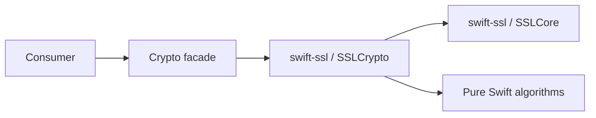

# Swift Crypto

Swift Crypto is an open-source implementation of a substantial portion of the API of [Apple CryptoKit](https://developer.apple.com/documentation/cryptokit) suitable for use on Linux and ARM64 Windows platforms. It enables cross-platform or server applications with the advantages of CryptoKit.

## Using Swift Crypto

Swift Crypto is available as a Swift Package Manager package. To use it, add the following dependency in your `Package.swift`:

```swift
// swift-crypto 1.x, 2.x, 3.x, 4.x, and 5.x are almost API compatible, so most clients
// should allow any of them
.package(url: "https://github.com/1amageek/swift-crypto.git", "1.0.0" ..< "6.0.0"),
```

and to your target, add `Crypto` to your dependencies. You can then `import Crypto` to get access to Swift Crypto's functionality.

## Functionality

Swift Crypto exposes the portions of the CryptoKit API that do not rely on specialised hardware to any Swift application. It provides safe APIs that abstract over the complexity of many cryptographic primitives that need to be used in modern applications. These APIs encourage safe usages of the underlying primitives, follow cryptographic best practices, and should be the first choice for building applications that need to use cryptography.

The current features of Swift Crypto cover key exchange, key derivation, encryption and decryption, hashing, message authentication, and more.

For specific API documentation, please see our documentation.

## Implementation

This fork has one cryptographic backend on every supported target. `Crypto` is a
compatibility facade and `SSLCrypto` owns the implementations. The package graph is
therefore deliberately small:



The graph contains no BoringSSL, XKCP, Security.framework, or CryptoExtras target.
The historical C backend source trees have been removed from this fork, so there is
no alternate backend that can be selected by a build flag or by a consuming package.
Unsupported APIs fail at the typed API boundary; they do not silently fall back to
another backend.

`Crypto` keeps the CryptoKit-shaped public ownership boundary. The facade may
materialize an owned `Data` value at that API boundary, while `SSLCrypto` keeps
borrowed byte ranges, secret scalars, and shared secrets in scoped storage. Native,
WASI, and Embedded WASI `Crypto` products are compile-verified with the pinned Swift
6.4 development snapshot.

Long-running performance and differential measurements are intentionally not part of
the normal `Crypto` test target. They live in
[`swift-ssl/Benchmarks`](../swift-ssl/Benchmarks), with the current result tables in
[`swift-ssl/README.md`](../swift-ssl/README.md). The current Native SHA-256 gate is
not claimed as passed: the measured 64-byte, 1-KiB, and 16-KiB workloads are
`1.0939x`, `0.8612x`, and `0.8399x` relative to the pinned BoringSSL reference.
The WASI and Embedded WASI 1-MiB exploratory workloads are above `1.10x`, but they
do not replace the Native gate.

## Evolution

The vast majority of the Swift Crypto code is intended to remain in lockstep with the current version of Apple CryptoKit. For this reason, patches that extend the API of Swift Crypto will be evaluated cautiously. For any such extension there are two possible outcomes for adding the API.

Firstly, if the API is judged to be generally valuable and suitable for contribution to Apple CryptoKit, the API will be merged into a Staging namespace in Swift Crypto. This Staging namespace is a temporary home for any API that is expected to become available in Apple CryptoKit but that is not available today. This enables users to use the API soon after merging. When the API is generally available in CryptoKit the API will be deprecated in the Staging namespace and made available in the main Swift Crypto namespace.

Secondly, if the API is judged not to meet the criteria for acceptance in general CryptoKit but is sufficiently important to have available for server use-cases, it will be merged into a Server namespace. APIs are not expected to leave this namespace, as it indicates that they are not generally available but can only be accessed when using Swift Crypto.

Note that Swift Crypto does not intend to support all possible cryptographic primitives. Swift Crypto will focus on safe, modern cryptographic primitives that are broadly useful and that do not easily lend themselves to misuse. This means that some cryptographic algorithms may never be supported: for example, 3DES is highly unlikely to ever be supported by Swift Crypto due to the difficulty of safely deploying it and its legacy status. Please be aware when proposing the addition of new primitives to Swift Crypto that the proposal may be refused for this reason.

### Code Organisation

The public facade lives under `Sources/Crypto`. Backend adapters live in the
`SSLCrypto` directories and are the only implementations included by the SwiftPM
target. The old C backend directories are not part of this fork.

Changes to the facade should preserve its CryptoKit-compatible ownership and error
contracts. Changes to an `SSLCrypto` adapter must preserve the backend protocol,
borrowed-buffer lifetime, and secret-memory clearing rules. New primitives belong in
`swift-ssl/SSLCrypto` first, followed by a small facade adapter and differential tests
at the facade boundary.

## Contributing

Before contributing please read [CONTRIBUTING.md](CONTRIBUTING.md), also make sure to read the two following sections.

#### Contributing new primitives

To contribute a new cryptographic primitive to Swift Crypto, you should address the following questions:

1. What is the new primitive for?
2. How widely is it deployed?
3. Is it specified in any public specifications or used by any such specification?
4. How easy is it to misuse?
5. In what way does Swift Crypto fail to satisfy that use-case today?

In addition, new primitive implementations will only be accepted in cases where the implementation is thoroughly tested, including being tested with all currently available test vectors. If the [Wycheproof](https://github.com/google/wycheproof) project provides vectors for the algorithm those should be tested as well. It must be possible to ensure that we can appropriately regression test our implementations.

#### Contributing bug fixes

If you discover a bug with Swift Crypto, please report it via GitHub.

If you are interested in fixing a bug, feel free to open a pull request. Please also submit regression tests with bug fixes to ensure that they are not regressed in future.

If you have issues with CryptoKit, instead of Swift Crypto, please use [Feedback Assistant](https://feedbackassistant.apple.com) to file those issues as you normally would.

### Get started contributing

#### `gyb`

Some of the files in this project are autogenerated (metaprogramming) using the Swift Utils tools called [gyb](https://github.com/apple/swift/blob/main/utils/gyb.py) (_"generate your boilerplate"_). `gyb` is included in [`./scripts/gyb`](scripts/gyb).

`gyb` will generate some `Foobar.swift` Swift file from some `Foobar.swift.gyb` _template_ file. **You should not edit `Foobar.swift` directly**, since all manual edits in that generated file will be overwritten the next time `gyb` is run.

You run `gyb` for a single file like so:

```bash
./scripts/gyb --line-directive "" Sources/Foobar.swift.gyb -o Sources/Foobar.swift
```

More conveniently you can run the bash script `./scripts/generate_boilerplate_files_with_gyb.sh` to generate all Swift files from their corresponding gyb template.

**If you add a new `.gyb` file, you should append a `// MARK: - Generated file, do NOT edit` warning** inside it, e.g.

```swift
// MARK: - Generated file, do NOT edit
// any edits of this file WILL be overwritten and thus discarded
// see section `gyb` in `README` for details.
```

### Security

If you believe you have identified a vulnerability in Swift Crypto, please [report that vulnerability to Apple through the usual channel](https://support.apple.com/en-us/HT201220).

### Swift versions

The most recent versions of Swift Crypto support Swift 6.2 and newer. The minimum Swift version supported by Swift Crypto releases are detailed below:

Swift Crypto        | Minimum Swift Version
--------------------|----------------------
`2.0.0  ..< 2.1.0`  | 5.2
`2.1.0  ..< 2.2.0`  | 5.4
`2.2.0  ..< 2.4.2`  | 5.5
`2.4.2  ..< 3.1.0`  | 5.6
`3.1.0  ..< 3.3.0`  | 5.7
`3.3.0  ..< 3.8.0`  | 5.8
`3.9.0  ..< 3.13.0` | 5.9
`3.13.0 ..< 4.0.0`  | 5.10
`4.0.0  ..< 4.4.0`  | 6.0
`4.4.0  ..< 5.0.0`  | 6.1
`5.0.0 ...`         | 6.2

### Compatibility

Swift Crypto follows [SemVer 2.0.0](https://semver.org/#semantic-versioning-200). Our public API is the same as that of CryptoKit (except where we lack an implementation entirely), as well as everything in the Server and Staging namespaces. Any symbol beginning with an underscore, and any product beginning with an underscore, is not subject to semantic versioning: these APIs may change without warning. We do not maintain a stable ABI, as Swift Crypto is a source-only distribution.

What this means for you is that you should depend on Swift Crypto with a version range that covers everything from the minimum Swift Crypto version you require up to the next major version.
In SwiftPM that can be easily done specifying for example `from: "1.0.0"` meaning that you support Swift Crypto in every version starting from 1.0.0 up to (excluding) 2.0.0.
SemVer and Swift Crypto's Public API guarantees should result in a working program without having to worry about testing every single version for compatibility.

Swift Crypto 2.0.0 was released in September 2021. The only breaking change between Swift Crypto 2.0.0 and 1.0.0 was the addition of new cases in the `CryptoError` enumeration. For most users, then, it's safe to depend on either the 1.0.0 _or_ 2.0.0 series of releases.

Swift Crypto 3.0.0 was released in September 2023. Again the only breaking change was the addition of new cases in the `CryptoError` enumeration, so most users can safely depend on the 1.0.0, 2.0.0, or 3.0.0 series of releases.

Swift Crypto 4.0.0 was released in September 2025. Again the only breaking change was the addition of new cases in the `CryptoError` enumeration, so most users can safely depend on the 1.0.0, 2.0.0, 3.0.0, or 4.0.0 series of releases. This fork does not publish the historical `CryptoExtras` product.

Swift Crypto 5.0.0 was released in September 2026. Because this version is only supported on Swift versions that support extensible enums, this release has mechanically marked all non-frozen public enums in CryptoKit as `@nonexhaustive`, which should mitigate the need for any future major releases of Swift Crypto. Most users will be able to depend on the 1.0.0, 2.0.0, 3.0.0, 4.0.0 or 5.0.0 series of releases.

To do so, please use the following dependency in your `Package.swift`:

```swift
.package(url: "https://github.com/1amageek/swift-crypto.git", "1.0.0" ..< "6.0.0"),
```

### Developing Swift Crypto on macOS

Swift Crypto normally defers to the OS implementation of CryptoKit on macOS. Naturally, this makes developing Swift Crypto on macOS tricky. To get Swift Crypto to build the open source implementation on macOS, in `Package.swift`, use a Linux container. A Dev Container config is provided in the repo to make this easier.


## Acknowledgements

This fork is implemented in Swift and uses the Pure Swift backend supplied by
[`swift-ssl`](../swift-ssl). No historical C backend files remain in the source tree.
