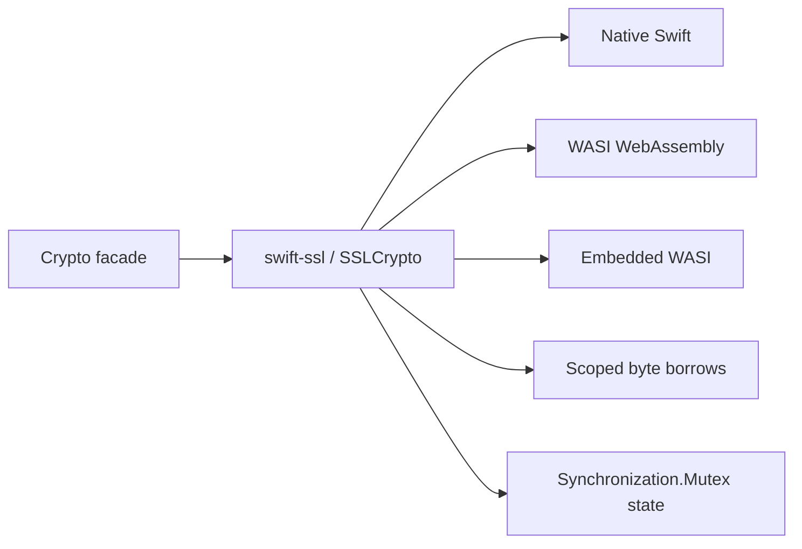

# WASM and Embedded Support

This fork has one implementation path on every target. ``Crypto`` is a
CryptoKit-shaped facade and ``SSLCrypto`` in ``swift-ssl`` owns the algorithms.
There is no C backend or target-specific replacement path.

## Validated toolchain

The checked-in validation baseline is:

| Item | Value |
| --- | --- |
| Toolchain | ``swift-6.4.x-DEVELOPMENT-SNAPSHOT-2026-07-23-a`` |
| Toolchain identifier | ``org.swift.64202607231a`` |
| Compiler commit | ``ef761e567dc94ee`` |
| WASM SDK | ``swift-6.4.x-DEVELOPMENT-SNAPSHOT-2026-07-23-a_wasm`` |
| Embedded SDK | ``swift-6.4.x-DEVELOPMENT-SNAPSHOT-2026-07-23-a_wasm-embedded`` |
| Target | ``wasm32-unknown-wasip1`` |

The WASM and Embedded SDK must have the same snapshot date and branch as the
compiler. Embedded links ``libswiftUnicodeDataTables.a`` when the target requires
Unicode tables.

## Ownership and zero-copy contract

Hot paths accept a borrowed ``Span<UInt8>`` or ``UnsafeRawBufferPointer`` inside a
scoped closure. The pointer never escapes the borrow and the owner remains
responsible for deallocation and zeroization.

| Boundary | Contract |
| --- | --- |
| Public facade | Materialize owned ``Data`` only at the API result boundary |
| SSLCrypto input | Borrow contiguous bytes without an intermediate array |
| Secret state | Own storage, clear it before release, and expose no raw pointer |
| Shared mutable state | Use the same ``Synchronization.Mutex<State>`` on Native, WASM, and Embedded |
| Final output | Copy once into the caller-visible representation |

The SHA-256 implementation processes full blocks directly from the borrowed input.
Only a fragment that completes a block is copied into its bounded inline tail. The
final digest is initialized directly from the eight state words.

## Target matrix

| Target | Product validation | Runtime validation |
| --- | --- | --- |
| Native | ``swift build --product Crypto`` | Crypto unit suite and Pure Swift backend fixtures |
| WASI | ``swift build --swift-sdk <WASM SDK> --product Crypto`` | Release digest validator |
| Embedded WASI | ``swift build --swift-sdk <Embedded SDK> --product Crypto`` | Release validator with matching Unicode archive |

Debug Swift Testing execution on WASM is not used as a release gate because the
current runtime can leave the testing helper suspended. Product compile/link and
release validators are the authoritative WASM checks.

## Tests and benchmarks

Correctness tests remain in ``Tests/CryptoTests`` and cover success, malformed
input, authentication failure, key agreement, signatures, KEM vectors, and
zeroization boundaries. Long-running performance tests are deliberately separate
from the normal test target. They live in ``swift-ssl/Benchmarks`` and compare the
production Pure Swift path with a pinned BoringSSL reference only for measurement.

The current Native SHA-256 gate is not passed at every requested size; the exact
ratios and the WASI/Embedded exploratory results are recorded in
``swift-ssl/README.md``. No benchmark result is used to select a runtime backend.

## Adding a primitive

Implement the primitive in ``swift-ssl/SSLCrypto`` first. Add the smallest
CryptoKit-shaped adapter under ``Sources/Crypto`` and differential tests at the
facade boundary. Preserve typed failure, scoped lifetime, and the common
Native/WASI/Embedded synchronization contract.
